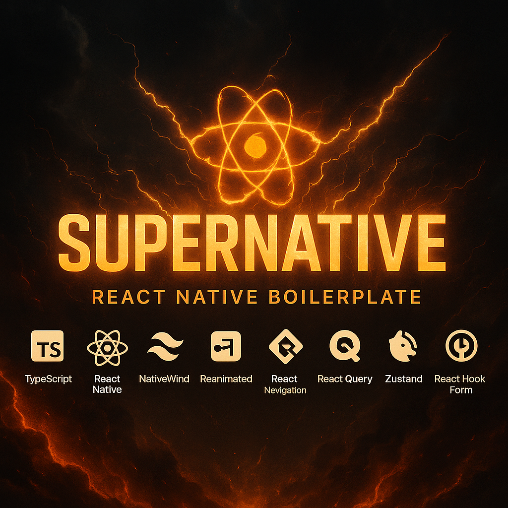

# 🚀 SuperNative : React Native Supercharged Boilerplate



A highly scalable, production-ready React Native boilerplate packed with modern tools and best practices for building mobile applications as fast as possible.

## ✨ Features

### 🛠 Core Technologies
- **TypeScript** - For type-safe development
- **React Native** - Latest stable version

### 🎨 UI & Animation
- **NativeWind** - Tailwind CSS for React Native
- **Reanimated** - High-performance animations
- **RNR (React Native Reusables)** Collection of Shadcn like components 
- **Lucid Icons** - Beautiful, consistent icon set
- **Safe Area View** - Proper layout handling across devices
- **React Native Bootsplash** - Native splash screen handling
- **Legend List** - High-performance virtualized lists

### 🧭 Navigation
- **React Navigation** - Type-safe routing and navigation with full TypeScript support, deep linking, and gesture handling

### 📡 Data Fetching 
- **React Query** - Powerful data fetching and caching with automatic background refetching, infinite scrolling, and optimistic updates

### 🗄️ State Management & Persistence
- **Zustand** - Lightweight state management with persistence, middleware support, and TypeScript-first approach

### 📝 Form and Validations
- **React Hook Form** - High-performance form handling with minimal re-renders and built-in form state management
- **Zod** - TypeScript-first schema validation with runtime type checking and automatic type inference

### 🌐 Internationalization
- **react-i18next** - Complete internationalization solution

### 🐛 Debugging
- **Reactotron** - Advanced debugging and development tools
    - Network request monitoring
    - State management inspection
    - Logging and error tracking

### 🧪 Testing & Development
- **Jest + React Testing Library** - Comprehensive testing suite

## 🚀 Getting Started

### Installation

1. Clone the repository:
```bash
git clone [repository-url]
cd [project-name]
```

2. Install dependencies:
```bash
bun install
```

3. In one terminal:
```bash
bun start
```

4. In another temrinal
```bash
# For Android
bun android

# For iOS
bun ios
```

## 🛠 Development Tools

### Reactotron Setup
1. Download Reactotron from the [latest releases](https://github.com/infinitered/reactotron/releases) (look for reactotron-app)
2. Launch Reactotron
3. The boilerplate is pre-configured to connect automatically

### Icons 
To use custom icons with className support, add them to the `ICONS` object in `@lib/icons`.


## 📝 License
This project is licensed under the MIT License - see the LICENSE file for details.

